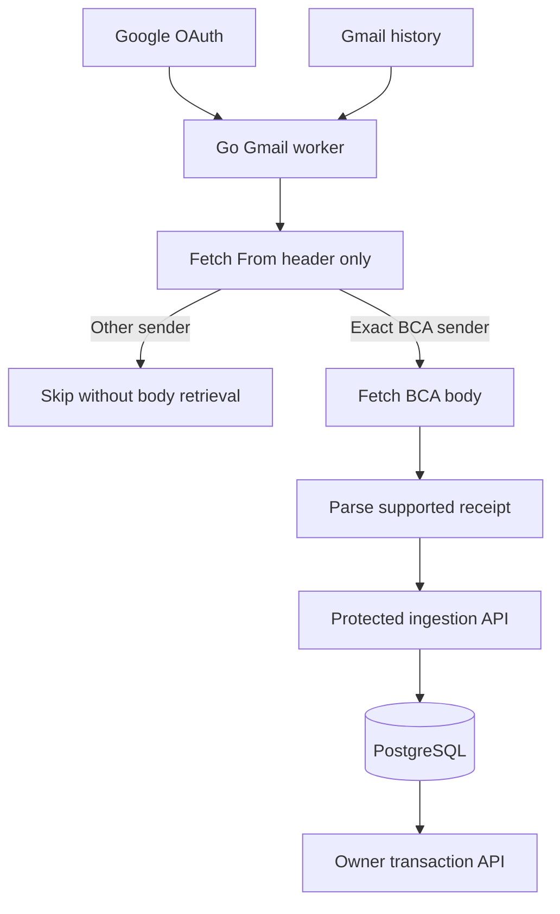

# BCA Email Import Backend Implementation Plan

**Date:** 2 October 2026  
**Updated:** 3 October 2026 with detailed backend technology choices  
**Scope:** Production backend for personal use  
**Language:** Go  
**Database:** PostgreSQL  
**Delivery:** HTTP API, Gmail polling worker, deployment files, automated tests, OpenAPI specification, Postman collection, and Postman environment template

## 1 Agreed behavior

Build one Go application that connects to the owner's Gmail account through Google OAuth, polls for new messages every 60 seconds, reads only selected sender metadata before deciding whether to retrieve a message body, and imports supported BCA transfer receipts into PostgreSQL through a protected HTTP ingestion endpoint.

The exact sender allowlist is `bca@bca.co.id`. Parse the actual mailbox address from the `From` header; display names and substring matches do not qualify. Non-BCA email bodies, snippets, subjects, and other headers must not be fetched or stored during normal discovery. New message IDs are necessarily visible in mailbox history but should be processed transiently until the sender passes the gate.

After a BCA match, fetch the body, identify the receipt format, and validate required fields and successful status. BCA OTP, login, promotional, failed, and unknown emails do not become successful transaction records. Sender matching is a selection mechanism, not proof of authenticity; inspect receiver-added authentication evidence after the BCA gate and route failures or uncertainty to review.

Google's `gmail.readonly` permission remains mailbox-wide. The restriction above is enforced by our application and verified with tests, not by a BCA-specific OAuth scope.

This plan replaces the broader earlier PRD as the implementation scope for this backend stage. Flutter screens, Liquid Glass, budgets, dashboards, Kafka, Gmail watch, Pub/Sub, and support for additional banks are outside this stage. The API remains usable by a future Flutter or native client.

## 2 Architecture



Deploy one binary with an HTTP server and background worker in the same process. The worker uses a configured internal URL to POST parsed events to the ingestion endpoint. Start the HTTP listener before workers can deliver events. A separate worker process can be introduced later without changing the event contract.

The HTTP handler calls a transaction service, which owns validation and database writes. The worker never bypasses that service. The ingestion endpoint acknowledges success only after its database transaction commits. The database also holds BCA source jobs, sync checkpoints, encrypted credentials, and parser outcomes.

### 2.1 Runtime and database

| Area | Technology | Use in this service |
| --- | --- | --- |
| Language and runtime | Go 1.27.x | One compiled service containing the HTTP API and Gmail worker; select and pin a maintained patch release at repository setup |
| HTTP server and client | Standard library `net/http` | Server timeouts, bounded request bodies, outbound connection reuse, OAuth and internal ingestion requests |
| Router | `github.com/go-chi/chi/v5` | Versioned REST routes, route groups, request IDs, panic recovery and owner/worker authorization middleware |
| JSON | Standard library `encoding/json` | Explicit request/response structs; reject unknown input fields, trailing JSON and invalid financial values |
| Input validation | Explicit Go validation functions | Validate exact sender, supported templates, amounts, currencies, references and classification; map failures to stable API errors |
| Database | PostgreSQL 17.x | Relational financial records, source identities, application sessions, sync checkpoints and persistent job state; pin a supported patch release |
| Driver and pool | `github.com/jackc/pgx/v5/pgxpool` | Context-aware queries, bounded connection pool and explicit PostgreSQL transactions |
| Query generation | sqlc configured with `sql_package: pgx/v5` | Generate typed Go methods from checked-in SQL; generated code is committed and checked for drift in CI |
| Schema migrations | `github.com/golang-migrate/migrate/v4` and its PostgreSQL driver | Ordered SQL migrations through a separate deployment command; record applied versions and test rollback where safe |
| Record identifiers | `github.com/google/uuid` | UUID identifiers for jobs, transactions and sessions; Gmail IDs and bank references remain separate source identities |
| Money representation | Go `int64` and PostgreSQL BIGINT | Exact minor units at scale 2; decimal-string API values are parsed with explicit overflow and precision checks |
| Timezone interpretation | Standard library `time` and embedded `time/tzdata` | Parse source-local times in Asia/Jakarta, normalize to UTC, and support timezone lookup in the production container |

PostgreSQL 17 is an intentional supported baseline for this project. The plan does not require upgrading an existing database to another major version. The Go binary uses pgx and generated SQL directly; database behavior stays explicit in migrations and query files.

### 2.2 Google authorization and application security

| Area | Technology | Use in this service |
| --- | --- | --- |
| Google OAuth | `golang.org/x/oauth2` with the Google provider configuration | Authorization-code exchange, offline access, access-token refresh and server-only Google credentials |
| Google identity verification | `github.com/coreos/go-oidc/v3/oidc` | Validate Google ID tokens using provider keys, issuer, client audience and expiry; check nonce and configured owner identity |
| Gmail API | `google.golang.org/api/gmail/v1` | `GetProfile`, paginated `Messages.List`, `History.List`, metadata-only `Messages.Get`, and gated BCA body retrieval |
| Application access tokens | `github.com/golang-jwt/jwt/v5` | Short-lived application JWTs, initially 15 minutes, signed with a dedicated HS256 key; require the configured algorithm, issuer, audience and expiry |
| Application refresh tokens | `crypto/rand` and `crypto/sha256` | Generate high-entropy opaque tokens, store only hashes, rotate on use and revoke reused token families; initial absolute session lifetime is 30 days |
| Google token and BCA source encryption | `crypto/aes`, `crypto/cipher`, `crypto/rand` | AES-256-GCM with a new nonce per encryption, authenticated record context and key version for rotation |
| Owned-account matching | `crypto/hmac` and `crypto/sha256` | Keyed matching token derived from normalized bank and account identifier, plus a masked display value |
| Worker authentication | Dedicated server-only bearer secret and constant-time comparison | Authenticate the internal ingestion route without granting access to owner transaction APIs |
| Request throttling | `golang.org/x/time/rate` with bounded limiter storage | Limit authentication, manual sync and retry requests; the initial deployment has one service instance |
| Secrets and environment | `os.LookupEnv` and validated configuration structs | Load credentials from deployment secrets or protected environment configuration; development examples contain placeholders only |

Keep JWT signing, encryption, account matching and worker secrets separate. Google access/refresh tokens never become application API tokens. OAuth state, nonce and one-time application login-code hashes have short expiry and one-time-use semantics in PostgreSQL. Logs and errors exclude all secret material.

### 2.3 Polling jobs and email parsing

| Area | Technology | Use in this service |
| --- | --- | --- |
| Scheduling and cancellation | Go goroutines, `time.Timer`, `context` and `sync` | Immediate startup sync, approximately 60-second polling with jitter, bounded concurrency and graceful shutdown |
| Durable jobs | PostgreSQL job rows with atomic claims and `FOR UPDATE SKIP LOCKED` | Retryable BCA processing, expiring leases and crash recovery; do not hold database row locks during Gmail or HTTP calls |
| Discovery coordination | PostgreSQL integration lease with a generation/fencing value | Prevent competing sync runs and reject checkpoint writes from a worker whose lease has expired |
| Retry behavior | Small Go retry helper with capped exponential backoff | Handle transient Gmail and internal delivery errors, apply jitter and honor provider retry instructions |
| Sender parsing | Standard library `net/mail` | Parse the actual From mailbox and enforce the exact allowlist before any body request |
| Gmail body decoding | `encoding/base64`, MIME metadata traversal and standard MIME utilities | Decode base64url body data and charset/encoding information; choose one usable plain-text or HTML alternative |
| HTML extraction | `golang.org/x/net/html` | Walk tables into normalized field labels and values; handle nested beneficiary rows without executing content |
| Charset conversion | `golang.org/x/net/html/charset` | Decode declared HTML character sets before parsing; reject unsupported or malformed encodings safely |
| Text normalization | `strings`, `unicode`, and narrowly scoped `regexp` | Normalize whitespace and known labels; validate specific field formats rather than parsing complete HTML with regular expressions |
| Parser versioning | Explicit Go parser structs behind a bank-parser interface | Implement BCA account-transfer and interbank-transfer formats with fixture-based expected results |

The initial worker uses limited concurrency, initially two processing jobs per instance, and a small database pool, initially four connections. Treat these as tunable starting values verified by tests. HTTP clients have explicit timeouts and response-size limits. Source ownership and financial classification remain application rules, not text guesses based on a beneficiary name.

### 2.4 API documentation and developer tooling

| Area | Technology | Use in this service |
| --- | --- | --- |
| API specification | OpenAPI 3.0.3 in `docs/openapi.yaml` | Document authorization, endpoints, payloads, decimal-string amounts, nullable fees, error codes and examples |
| Specification checks | `github.com/getkin/kin-openapi/openapi3` in a tooling/test command | Validate the checked-in OpenAPI document and selected contract examples; handlers still enforce business rules |
| Interactive API testing | Postman with Collection v2.1 JSON | Maintain requests and response assertions for every backend route, including duplicate delivery and authorization failures |
| Headless API checks | Newman with a pinned npm dependency | Run the v2.1 collection and environment locally and in CI, producing CLI and JUnit results |
| Postman test runtime | Supported Node.js LTS release used only for tooling | Execute Newman; record the exact Node version and commit the tooling `package-lock.json` |
| Go dependency management | Go modules, `go.mod`, `go.sum` and `go mod verify` | Reproducible application dependencies and module integrity checks |
| Repeatable commands | Makefile | Targets for generation, build, tests, migrations, fixture seeding, local services and Postman runs |
| Continuous integration | GitHub Actions | Build, run Go and PostgreSQL tests, verify generated SQL, validate OpenAPI, run Newman and publish a versioned container image |

Keep the collection in v2.1 JSON because the chosen Newman runner uses that format. Do not silently migrate it to Postman's newer collection format without changing and validating the runner. Newman and Node are development/CI tools; neither is part of the deployed Go service.

### 2.5 Tests and operational tooling

| Area | Technology | Use in this service |
| --- | --- | --- |
| Unit and parser tests | Standard library `testing` and table-driven fixtures | Assert exact fields, money, statuses, charset handling and privacy gates |
| HTTP tests | `net/http/httptest` and a recording fake Gmail interface | Inspect requested formats/fields and verify unrelated bodies are never fetched |
| Database tests | Real PostgreSQL 17 in an isolated Docker Compose test service | Verify constraints, atomic completion, lease recovery and concurrent deduplication |
| Concurrency checks | `go test -race` | Check worker, token refresh and request concurrency where supported by the CI environment |
| Formatting and analysis | `gofmt`, `go vet`, and `golang.org/x/vuln/cmd/govulncheck` | Maintain Go formatting and check code and dependencies before release |
| Structured logs | Standard library `log/slog` JSON handler | Emit safe identifiers, timings, job outcomes and request IDs without email or financial content |
| Service metrics | `github.com/prometheus/client_golang` | Expose queue age, sync success, parser outcomes and API latency through a private `/metrics` endpoint |
| Metrics collection | Prometheus integration with the operator's monitoring stack | Scrape the backend endpoint; avoid deploying a second monitoring stack just for this service |
| Container build | Docker multi-stage build | Compile Go with `CGO_ENABLED=0`; include CA certificates and embedded timezone data in the runtime |
| Runtime image | Debian slim with non-root user | Run only the compiled service and necessary trust files; pin the tested base image digest |
| Service orchestration | Docker Compose v2 | Run the service, PostgreSQL and reverse proxy on explicit networks with health checks and persistent volumes |
| HTTPS reverse proxy | Nginx stable release pinned at setup | Terminate TLS, forward owner API/OAuth routes, bound requests and restrict internal ingestion and metrics access |
| Backup tools | PostgreSQL `pg_dump` and `pg_restore`, plus the age CLI | Encrypt logical backups to a configured age recipient and copy them off host; keep decryption identity and application encryption-key recovery separately protected |

No observability or test tool may collect real email bodies or credentials. Financial-reference fixtures and Postman requests use synthetic identifiers. The private metrics endpoint is part of the deployment contract and is not an owner transaction API.

### 2.6 Version and reproducibility policy

The baseline is Go 1.27.x, PostgreSQL 17.x, chi v5, pgx v5, migrate v4, go-oidc v3, jwt v5, Gmail API v1, OpenAPI 3.0.3 and Postman Collection v2.1. These names specify language or library families, not an unverified claim that every patch is the latest.

During Stage 1, resolve exact maintained package/tool releases, validate compatibility, commit `go.mod`, `go.sum`, tooling lockfiles and the selected toolchain versions, and pin deployment images. Keep sqlc, migration tooling and the Go version consistent across local generation, CI and container builds. Dependency updates run the normal checks before changing those pins.

The frontend remains outside this implementation stage. None of these backend choices depends on Flutter widgets, iOS Liquid Glass or Android presentation.

## 3 Implementation sequence

| Stage | Deliverable | Completion criterion |
| --- | --- | --- |
| 1 | Repository, configuration, health endpoints, migration tooling, API contract skeleton | Application starts, connects to PostgreSQL, and fails clearly on invalid configuration |
| 2 | Database model and synthetic receipt fixtures | Constraints and fixture expected values are agreed and tested |
| 3 | Google OAuth, owner identity, application sessions, encrypted Gmail credentials | Owner can connect, reconnect, disconnect, and access protected APIs through Postman |
| 4 | Sender gate, initial discovery, history polling, durable jobs | Tests prove non-BCA bodies are never retrieved and new BCA jobs survive restart |
| 5 | Two BCA receipt parsers and unsupported-email handling | Both supplied formats parse exact financial fields without relying on table position |
| 6 | Ingestion endpoint, deduplication, delivery retries | Concurrent and repeated delivery causes one stored financial event |
| 7 | Read APIs, classification updates, processing status and retry controls | Backend can be operated without a mobile frontend |
| 8 | Complete Postman collection and repeatable API validation | Collection imports cleanly and its runnable requests pass against the deployed test service |
| 9 | Deployment, monitoring, backup restoration and real mailbox validation | Outage recovery and production readiness checklist pass |

Create the Postman collection skeleton in Stage 1 and update it with every endpoint. Stage 8 verifies completeness; it is not the first time API examples are written.

## 4 Repository organization

| Path | Responsibility |
| --- | --- |
| `cmd/service/main.go` | Wiring, startup, HTTP listener, worker lifecycle, graceful shutdown |
| `internal/config` | Environment parsing and validation |
| `internal/auth` | Google flow, owner authorization, application sessions |
| `internal/gmail` | Provider calls, sender metadata gate, checkpoints, recovery |
| `internal/jobs` | BCA processing jobs, leases, retries |
| `internal/parser/bca` | HTML extraction and versioned receipt parsers |
| `internal/transaction` | Event validation, deduplication, classification and persistence |
| `internal/httpapi` | Routes, middleware, errors and response mapping |
| `internal/database` | Generated sqlc queries and transaction helpers |
| `db/migrations` | Forward and rollback migrations |
| `db/queries` | Explicit SQL query definitions |
| `testdata/bca` | Synthetic and properly sanitized email fixtures |
| `docs/openapi.yaml` | Request and response contracts |
| `docs/postman` | Collection, environment template, and run instructions |
| `deploy` | Container and reverse-proxy configuration |

Keep parser and business services independent of HTTP and Gmail client implementations. Mock provider and HTTP boundaries for deterministic failure tests.

## 5 Database design

Use the following initial tables. This is the implementation schema outline, not final migration SQL.

| Table | Important fields |
| --- | --- |
| `users` | UUID, stable Google subject, verified email, timezone, creation time |
| `sessions` | Owner, hashed application refresh token, expiry, revocation and rotation family |
| `auth_flows` | Hashed OAuth state, nonce binding and one-time application login codes with expiry and consumed state |
| `gmail_integrations` | Owner, stable provider mailbox identity, encrypted refresh token, encryption key version, connection status |
| `gmail_sync_state` | Integration, opaque history checkpoint, coverage start, last attempt, last success, lease and recovery status |
| `bca_email_jobs` | Integration, Gmail message ID, processing state, attempts, retry time, lease, parser version, reason code, encrypted BCA source and parsed delivery payload |
| `transactions` | Owner, source integration, bank reference, receipt kind, financial classification, transaction time, principal, optional fee, currencies, source alias, destination bank and masked destination, parser version |
| `transaction_sources` | Transaction and BCA email job links for multiple receipts describing one event |
| `owned_accounts` | Owner, bank, account matching token, masked display identifier and label |
| `transaction_audit` | Owner, transaction, action, time, allowed before and after fields |

### Constraints and representations

- Preserve stable mailbox identity across reconnection. Enforce one BCA job per mailbox and Gmail message ID; reconnecting must not reset deduplication.
- Use a bank-reference lookup scoped to owner, bank and source account. A reliable reference with compatible fields can link another receipt to the existing event. Conflicting values require review rather than silent replacement. Do not assume all future BCA references describe the same event type.
- Store amounts as BIGINT minor units at scale 2, with nonnegative fee and strictly positive principal constraints. API amounts are decimal strings in major units, converted exactly at the boundary. Rp90,000.00 becomes 9,000,000 minor units; Rp3,300,000.00 becomes 330,000,000; Rp2,500.00 becomes 250,000.
- Keep an unspecified fee as NULL. A missing fee field is not evidence of zero fee. Calculate total debit only when the template establishes amount semantics and a known fee.
- Use UTC TIMESTAMPTZ for normalized occurrence time. The source timestamp lacks an offset; preserve its local text and the configured interpretation timezone, initially Asia/Jakarta.
- Distinguish provider receipt kind (`bca_transfer` or `interbank_transfer`) from financial classification (`unclassified`, `expense`, or `internal_transfer`). Both initial templates represent outgoing bank activity; beneficiary ownership is a separate decision.
- Record a source category or purpose only when present. Do not invent merchant, expense category, or complete account balance.
- Prefer masked beneficiary identifiers for display and keyed matching tokens for known accounts. Full identifiers may exist only inside the encrypted retained BCA source unless an explicit feature needs them. Do not log account numbers or beneficiary names.

Persist encrypted source bodies for a configurable period, initially 30 days, to support parser correction. Preserve source IDs, reference links, owner decisions, and processing outcome after body cleanup. Non-BCA headers and bodies are never stored. Unsupported BCA emails should retain only minimal outcome information by default; do not retain OTP content.

## 6 Google OAuth and owner API authentication

1. Create a Google Cloud project, enable Gmail API, configure the consent screen, and register the exact backend callback URI.
2. Request `openid`, `email`, and `gmail.readonly`. Request offline access so the worker can refresh access without an open client.
3. Generate a short-lived, single-use state value and bind it to the browser initiating the flow. Validate state and the exact redirect target; use the provider-supported authorization-code flow and PKCE where applicable.
4. Exchange the Google authorization code on the server. Validate identity issuer, audience, signature, expiry, and stable subject. Restrict sign-in to the configured owner subject; do not expose open signup.
5. Encrypt the refresh token using authenticated encryption and a versioned key outside PostgreSQL. Retain an existing valid refresh token if a subsequent exchange does not return a replacement.
6. Create an application session independently of Google's token. Owner API requests use application bearer access tokens; worker delivery uses a separate server-only credential.
7. Support rotating application refresh tokens and logout. A revoked or invalid Gmail refresh token pauses ingestion and sets `reconnect_required` without deleting transactions.
8. Disconnecting clears usable integration credentials, stops new jobs and active delivery as safely as possible, and preserves imported records and deduplication state. Reconnection restores the same mailbox identity.

For backend-only setup, provide a minimal browser page to initiate authorization and complete login. A successful callback may show a short-lived, single-use **application login code** on the authenticated page. Postman can exchange it at `/api/v1/auth/exchange` for application tokens. Do not display Google tokens or put application tokens in callback URLs. Keep the application code out of logs and expire it after approximately 60 seconds.

Choose the intended production consent-screen setup before relying on unattended imports. Gmail read access is restricted; personal-use exceptions may apply. External applications in Testing status with Gmail scopes have limited refresh-token lifetime. Document the applicable setup and verify continued operation beyond seven days; changing publishing status alone is not an authorization guarantee.

## 7 Discovery and sender privacy boundary

### 7.1 Metadata request

Use the equivalent of:

```http
GET /gmail/v1/users/me/messages/{messageId}
    ?format=metadata
    &metadataHeaders=From
    &fields=id,payload/headers
```

The exact Go client field selector must be exercised against a real authorized account. `format=metadata` and `metadataHeaders=From` select headers; the partial-response field mask also excludes fields such as `snippet`. Do not retrieve a full message and discard its body after checking the sender.

Parse exactly one valid address with Go's mail-address parser. Normalize the address for comparison; require the exact allowlisted mailbox. Missing, malformed, multiple, or nonmatching sender values result in skip. No subjects, bodies, snippets, or header values from these messages enter the database or logs.

### 7.2 Initial import

1. Persist the integration and selected coverage start, initially 30 days before connection.
2. Acquire the integration discovery lease and capture a current Gmail history checkpoint **before** scanning messages.
3. Search eligible messages using `from:bca@bca.co.id` and an explicit coverage-start boundary. Do not add `is:unread` or an inbox-only constraint. Paginate all results. Sender search is only a discovery shortcut; still apply the exact metadata gate.
4. After a matching header, insert its BCA processing job with a unique source identity. A job can exist before its body is fetched.
5. When the scan completes, replay message additions since the captured checkpoint. This covers messages arriving during the initial scan.
6. Save the resulting discovery checkpoint only after all relevant discovery work has completed durably.

### 7.3 Continuous polling

- Run immediately on startup, then approximately every 60 seconds with small jitter. Prevent overlapping runs for the same integration using a PostgreSQL lease.
- Call `history.list` from the saved checkpoint, selecting message-added events and minimum response fields. It returns message IDs rather than receipt bodies. Follow every page.
- Deduplicate candidate IDs within a run, then apply the metadata gate to each new candidate. Existing known BCA jobs can be skipped by their source identity.
- Persist matching BCA jobs before advancing the discovery checkpoint. A transient sender-metadata failure prevents advancement past that unresolved discovery batch; replay is safe because job inserts are idempotent.
- Non-BCA message IDs remain transient. An already deleted message can be counted as unavailable without fetching its body. Report missing-source conditions honestly.
- Store the provider's appropriate terminal checkpoint, not a locally invented sequence or arbitrary maximum ID.
- If fetching a body or calling the ingestion endpoint fails later, the persisted job retries independently of mailbox discovery.

### 7.4 Recovery

On restart, recover expired job leases, resume pending jobs, and perform an immediate discovery run. If Gmail rejects an old history checkpoint with `404`, capture a fresh checkpoint, scan matching BCA messages from the integration's configured coverage start in bounded date slices, and replay new history from the captured point. Preserve all existing source and transaction identities.

A recovery scan does not resurrect an email deleted from Gmail before we captured its body. Mark coverage as recovering or incomplete until the scan finishes. Access revocation requires owner reconnection rather than infinite retries.

## 8 BCA parser implementation

Start with the two pasted receipt layouts. Use synthetic replacements for names, account identifiers and references in checked-in fixtures. Obtain sanitized HTML/MIME examples before treating the email decoder and authentication handling as validated against actual receipts.

Decode Gmail body data, walk MIME alternatives, and extract table rows from HTML into normalized label/value pairs. Handle nonbreaking spaces, empty colon cells, indentation, and nested beneficiary sections. Do not depend on exact row indices or greeting text. Prefer one usable text representation to avoid parsing both HTML and plain-text alternatives as separate events.

| Required mapping | BCA account transfer | Interbank transfer |
| --- | --- | --- |
| Receipt detector | `Transfer Type` identifies a BCA account transfer | `Transfer Type` and beneficiary bank identify another bank |
| Principal | `Transfer Amount` | `Amount` |
| Fee | Optional; NULL if absent | `Fee` when present |
| Destination | `Beneficiary Account` | Nested `Beneficiary Account No.` |
| Counterparty | `Beneficiary Name` | Nested `Beneficiary Name` |
| Reference | `Reference No.` | `Reference No.` |
| Source | `Source of Fund` | `Source of Fund` |
| Time and success | `Transaction Date`, `Status` | `Transaction Date`, `Status` |

Validate successful status, a recognized format, positive exact principal, currency, source, reference, destination details, and parseable local date. Parse separators based on the recognized format and never use float64. Check that separately listed currencies agree; this stage supports IDR only.

Represent unknown or contradictory required fields as `needs_review`. Unsupported templates become `unsupported`, and non-transaction or unsuccessful BCA notices become `ignored`. Distinguish these from network errors that should retry. Version each parser so retained BCA sources can be reprocessed later without duplicating transactions or overwriting owner classification.

Treat the Mandiri sample as principal Rp3,300,000 plus stated fee Rp2,500, with expected total debit Rp3,302,500 after template confirmation. The other sample contains no explicit fee. Neither beneficiary name nor `Transaction Purpose` proves account ownership.

Apply body-size and parse-time limits. Never execute HTML or fetch links, tracking pixels or remote images. Where receiver-added authentication results are available, evaluate them from a trusted receiver context; arbitrary authentication text in the email body is not evidence.

## 9 Durable jobs and ingestion API

Job states are `queued`, `processing`, `retry_wait`, `completed`, `ignored`, `unsupported`, `needs_review`, and `failed`. Claim jobs atomically with a short lease, allow lease renewal, and reclaim expired leases. Store attempt count, next attempt time, parser version and safe reason codes.

Use bounded exponential backoff with jitter for Gmail and ingestion network failures, and honor provider rate-limit instructions. After a bounded number of consecutive attempts, expose a failed job for manual retry. Reconnect-required integrations are paused separately. Avoid rapid retries during database or network outages.

### Endpoint

```http
POST /api/v1/webhooks/bca
Authorization: Bearer <worker-only-secret>
Content-Type: application/json
```

The worker credential must be distinct from owner session tokens and restricted to ingestion. Prefer a loopback or private service-network URL; enforce HTTPS if delivery crosses hosts. Ordinary owner access must not automatically grant worker ingestion access.

### Event payload

```json
{
  "source_job_id": "<persisted-bca-job-uuid>",
  "source_message_id": "<gmail-message-id>",
  "parser_version": "bca-interbank-v1",
  "bank_reference": "<synthetic-bank-reference>",
  "receipt_kind": "interbank_transfer",
  "status": "successful",
  "currency": "IDR",
  "amount": "3300000.00",
  "fee": "2500.00",
  "source_account_alias": "2180xxxx19",
  "beneficiary_bank": "BANK MANDIRI",
  "beneficiary_account_masked": "*********9066",
  "transaction_date_local": "2026-10-02T11:20:40",
  "timezone": "Asia/Jakarta"
}
```

The handler resolves mailbox and owner from the persisted job, not an arbitrary user ID in the payload. Require consistency between job identity, sender gate, parsed source and incoming fields. Source-job lookup also makes later delivery after integration disconnection rejectable.

Within one PostgreSQL transaction, validate the event, locate an existing compatible bank event, create or link the transaction, attach its source, and mark the job completed. Initial financial classification is `unclassified` unless an explicit owned-account mapping justifies internal-transfer classification.

Return `201` for a newly stored event, `200` for an identical repeated delivery, `409` for contradictory duplicate fields, `422` for invalid financial input, and `401` or `403` for failed authorization. Store principal and fee separately; do not double-count the total debit. A repeated source ID with altered values must not overwrite the original silently.

Persist the normalized delivery payload before its first POST, so retries are stable. If the server commits but the HTTP response is lost, the next request returns the existing transaction. Parser output changes require an explicit reprocessing path rather than changing a pending request unnoticed.

## 10 Backend endpoints

| Method | Route | Access and behavior |
| --- | --- | --- |
| GET | `/health/live` | Basic process liveness; no private details |
| GET | `/health/ready` | Database and migration readiness |
| GET | `/metrics` | Private Prometheus scrape endpoint; restrict access to the monitoring network |
| GET | `/auth/google/start` | Begin browser Google sign-in and Gmail connection |
| GET | `/auth/google/callback` | Validate state and complete server token exchange |
| POST | `/api/v1/auth/exchange` | Exchange a one-time application login code |
| POST | `/api/v1/auth/refresh` | Rotate application session credentials |
| POST | `/api/v1/auth/logout` | Revoke the application session |
| GET | `/api/v1/me` | Read the authenticated owner profile |
| GET | `/api/v1/integrations/gmail` | Connection, last successful discovery and recovery state |
| DELETE | `/api/v1/integrations/gmail` | Stop ingestion and remove usable Google credentials |
| POST | `/api/v1/integrations/gmail/sync` | Enqueue an immediate discovery run; return an operation ID |
| GET | `/api/v1/imports` | Paginated BCA jobs and safe outcomes |
| GET | `/api/v1/imports/{id}` | Processing detail without raw email content |
| POST | `/api/v1/imports/{id}/retry` | Retry an eligible failure with authorization and rate limits |
| POST | `/api/v1/webhooks/bca` | Worker-only normalized receipt ingestion |
| GET | `/api/v1/transactions` | Paginated records filtered by date, bank, classification or account |
| GET | `/api/v1/transactions/{id}` | Transaction detail with masked account information |
| PATCH | `/api/v1/transactions/{id}` | Owner classification and note updates with expected version |
| GET, POST | `/api/v1/owned-accounts` | Read or add accounts used for transfer ownership matching |

Manual expense creation, budgeting, financial dashboards, full accounting ledgers, and source-body viewing endpoints are not part of this service stage. Store fees and classification correctly so a future client can calculate spending without treating every transfer as an expense.

Use consistent JSON errors with a request ID and stable machine-readable code. Never return SQL, OAuth token responses, or email body excerpts as errors. Use deterministic cursor pagination. Manual sync requests must respect the same lease as scheduled runs.

## 11 Postman collection and environment

**Writing and validating a Postman collection is a required implementation deliverable.** Deliver these repository files:

- `docs/postman/bca-backend.postman_collection.json` using the Postman Collection v2.1 schema.
- `docs/postman/local.postman_environment.json` with harmless defaults and empty credential values.
- `docs/postman/README.md` explaining browser authorization, login-code exchange, variable setup, fixtures, automated runs, and staging differences.

### Collection folders

| Folder | Required requests |
| --- | --- |
| Health | Liveness and readiness |
| Authentication | Browser setup instructions, application exchange, refresh, current owner, logout |
| Gmail Integration | Status, immediate sync, operation outcome through status/imports, disconnect |
| Imports | List, inspect, eligible retry and invalid retry |
| BCA Ingestion | Synthetic BCA transfer, interbank transfer, duplicate delivery, conflicting duplicate, bad amount, unsuccessful status, unknown source job, missing worker credential |
| Transactions | List, detail, classification update, stale-version conflict |
| Owned Accounts | Add synthetic owned destination and inspect mappings |
| Authorization Failures | Missing or invalid owner token and owner-token attempts on worker-only ingestion |

### Variables and assertions

Use variables for `base_url`, application login code, access token, refresh token, worker token, source job ID, transaction ID, import ID and record version. Store tokens only in local sensitive variables; exported templates must contain no real credentials or financial records.

Post-response scripts verify expected status codes, required fields, exact decimal amount strings, NULL versus stated fee, masked identifiers, stable duplicate transaction IDs, version increments, and safe error codes. Scripts capture returned IDs and fresh session credentials for subsequent requests. Keep example bodies consistent with OpenAPI and the Go validation rules.

Worker ingestion requires a valid BCA source job. Prepare a database fixture through an explicit development-only seed command before automated runs; do not add a production endpoint that creates arbitrary ingestion jobs. The seed uses synthetic data, requires a dedicated test database, and refuses production configuration. Avoid embedding owner credentials or bypass authentication in production for Postman convenience.

The runner must not depend on the real owner's mailbox. Browser Google consent is an explicitly documented manual setup step; automated collection runs use short-lived test application credentials and synthetic source jobs. Collection tests cover the HTTP API, while provider mocks and Go integration tests cover the sender gate and history recovery.

Document running the collection through Postman Collection Runner and the pinned Newman runner in CI. Retain Collection v2.1 compatibility and confirm tooling versions and license suitability during setup. Mark disconnect and logout requests as end-of-run operations and make live-integration mutation opt-in; repeating a test run must not disconnect the owner's actual mailbox.

## 12 Verification plan

| Test area | Required evidence |
| --- | --- |
| Sender privacy | Fake Gmail client records requests; unrelated senders trigger metadata calls only, with no full/raw retrieval and no snippet response fields |
| Address parsing | Exact mailbox accepted; fake display names, substring domains, multiple senders and malformed From rejected |
| Discovery | All pages handled, read/archived receipts found, no overlapping sync, startup runs immediately |
| Initial import | Message arriving during the search scan is discovered by checkpoint replay |
| Checkpoint durability | Metadata failure prevents unsafe advancement; BCA jobs committed before checkpoint changes |
| Outage recovery | Restart catches new receipts, expired history triggers bounded recovery scan, missing emails are reported |
| Parser | Both supplied layouts, nested rows, whitespace, date, exact money, missing fee, explicit zero fee, malformed amount, missing reference and unknown format |
| Body safety | HTML does not fetch external content; malformed or oversized MIME is bounded; alternatives do not duplicate events |
| Database | Unique source identity, concurrent insertion and atomic transaction/job completion |
| Delivery | Crash before commit, crash after commit, lost response, lease expiry and retry preserve one event |
| Reconnect | Revocation pauses ingestion; reconnect preserves source identity; disconnect blocks new delivery |
| Authorization | State replay rejected, non-owner denied, owner tokens cannot ingest, worker tokens cannot read owner records |
| Classification | Known owned destination supports internal transfer; names and transaction purpose alone do not establish ownership |
| Postman | Collection and environment import; synthetic positive and negative HTTP assertions pass |
| Operations | Deployed restart, persistent volumes, off-host restore, secret exclusion and extended OAuth operation verified |

Run Go unit tests, PostgreSQL integration tests, worker race checks, a mocked-provider end-to-end test, and the Postman collection. Finally validate the actual Gmail header request and both sanitized BCA MIME formats against the authorized mailbox. Do not claim production accuracy solely from pasted text fixtures.

## 13 Deployment and operations

Validate environment variables such as `DATABASE_URL`, `HTTP_ADDR`, `INTERNAL_INGEST_URL`, `GOOGLE_CLIENT_ID`, `GOOGLE_CLIENT_SECRET`, `GOOGLE_REDIRECT_URI`, `OWNER_GOOGLE_SUB`, `TOKEN_ENCRYPTION_KEY`, application signing/session configuration, `WORKER_INGEST_TOKEN`, `POLL_INTERVAL`, `BCA_SENDER`, `IMPORT_TIMEZONE`, and source-retention days. Validate that the sender is the agreed exact allowlist value.

Build a small production image containing the Go binary and trusted CA certificates. Run as a non-root user with the database on a private container network and an HTTPS reverse proxy for OAuth and owner API access. The internal ingestion route should be protected from unnecessary public exposure. Development localhost may use HTTP according to the registered OAuth setup; production uses HTTPS.

Use PostgreSQL persistent storage and a documented off-host backup schedule. Start the listener before workers, stop new jobs during graceful shutdown, bound network timeouts, and allow unfinished leases to expire safely after a crash. Use one controlled migration step instead of every replica racing to migrate.

Log job IDs, request IDs, parser versions, safe outcome codes and timings. Exclude mail bodies, snippets, subjects, sender headers of non-BCA messages, names, full accounts, references and tokens. Observe last discovery success, recovery state, due-job age, retry count, parser failures, database health and backup freshness.

Return integration degradation in the status API. Readiness should not fail merely because Gmail is temporarily unavailable. After deployment, simulate service downtime while a synthetic authorized receipt arrives and verify catch-up without duplicates. Backup restoration must recover encryption keys securely and preserve disabled integrations rather than unexpectedly restarting them.

## 14 Completion checklist

- [ ] Backend runs independently of any Flutter frontend.
- [ ] Owner Google connection and application API authentication work.
- [ ] Gmail credentials are encrypted and excluded from logs and API responses.
- [ ] Only the From header is fetched before the BCA gate; unrelated bodies and snippets are not retrieved.
- [ ] Both BCA transfer formats parse exactly and unknown messages remain nonfinancial outcomes.
- [ ] Durable jobs, pagination and checkpoints survive restarts and outages.
- [ ] Ingestion authentication and deduplication prevent unauthorized or repeated financial effects.
- [ ] Principal, optional fee and transfer classification remain distinct.
- [ ] Read, classification, integration and retry APIs work without mobile screens.
- [ ] OpenAPI, Postman collection, environment template and run instructions are delivered and verified.
- [ ] Production containers, HTTPS, monitoring, persistent data and backup restore are verified.
- [ ] Real sanitized email fixtures and the intended Google authorization setup have passed acceptance.

## 15 Primary references

Provider behavior was checked on 2 October 2026; detailed stack references were checked on 3 October 2026. Scope, architecture, polling interval and implementation stages above are project decisions. Recheck provider documentation and supported tooling when implementation starts.

- [Gmail message retrieval](https://developers.google.com/workspace/gmail/api/reference/rest/v1/users.messages/get) for metadata header selection.
- [Gmail history retrieval](https://developers.google.com/workspace/gmail/api/reference/rest/v1/users.history/list) for checkpoints, pagination and change types.
- [Gmail synchronization](https://developers.google.com/workspace/gmail/api/guides/sync) for full and partial recovery.
- [Google server OAuth flow](https://developers.google.com/identity/protocols/oauth2/web-server) for server credentials and offline access.
- [Gmail scopes](https://developers.google.com/workspace/gmail/api/auth/scopes) for permission breadth and restrictions.
- [Google OAuth token expiration](https://developers.google.com/identity/protocols/oauth2#expiration) for Testing-mode and revocation behavior.
- [Postman collections](https://learning.postman.com/docs/use/use-collections/overview/) for collection organization.
- [Postman response test scripts](https://learning.postman.com/docs/tests-and-scripts/write-scripts/test-scripts/) for API assertions.
- [Go 1.27 release notes](https://go.dev/doc/go1.27) and [PostgreSQL support policy](https://www.postgresql.org/support/versioning/) for the runtime and database baselines.
- [chi v5](https://pkg.go.dev/github.com/go-chi/chi/v5) and [pgxpool v5](https://pkg.go.dev/github.com/jackc/pgx/v5/pgxpool) for HTTP routing and database connections.
- [sqlc with pgx](https://docs.sqlc.dev/en/latest/guides/using-go-and-pgx.html) and [golang-migrate](https://github.com/golang-migrate/migrate) for query generation and schema changes.
- [go-oidc](https://pkg.go.dev/github.com/coreos/go-oidc/v3/oidc) and [jwt v5](https://pkg.go.dev/github.com/golang-jwt/jwt/v5) for identity verification and application tokens.
- [Go Gmail client](https://pkg.go.dev/google.golang.org/api/gmail/v1) and [HTML parser](https://pkg.go.dev/golang.org/x/net/html) for provider calls and table extraction.
- [Newman collection runner](https://learning.postman.com/docs/reference/newman-cli/command-line-integration-with-newman/) for the headless Postman workflow.
- [Prometheus HTTP metrics](https://pkg.go.dev/github.com/prometheus/client_golang/prometheus/promhttp) and [Go vulnerability checks](https://go.dev/doc/security/vuln/) for operational and release tooling.
- [age encryption](https://github.com/FiloSottile/age) for encrypted off-host database backup archives.
