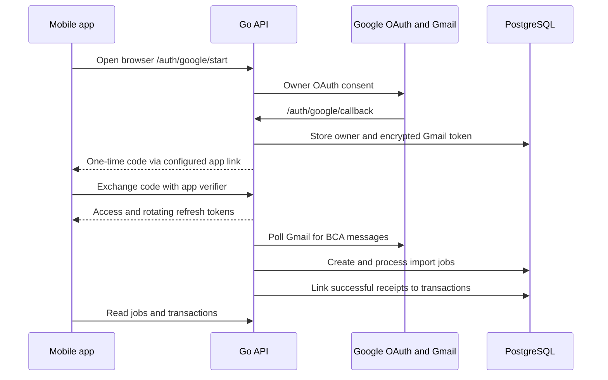

# Mobile app backend guide

This guide describes the **implemented** BCA backend contract for a mobile prototype. The endpoint inventory and request validation come from `internal/httpapi/api.go`; authentication comes from `internal/auth/auth.go`; import behavior comes from `internal/gmail/worker.go`. Use [OpenAPI](openapi.yaml) for a machine-readable starting point and the [Postman collection](postman/README.md) for runnable requests. This guide includes response details and workflow behavior that OpenAPI does not yet express.

## What the service does

One configured Google account is the owner. Signing in with that account also connects its Gmail mailbox. A background worker discovers messages from `bca@bca.co.id`, verifies the selected message, parses supported BCA receipts, and writes outgoing transactions. The app can inspect the connection, trigger discovery, monitor import jobs, view transactions, edit a transaction's classification and note, and register owned destination accounts.

The API is **owner-only**, except health checks and the browser OAuth start/callback. `/api/v1/webhooks/bca` uses a separate worker secret and is not a mobile endpoint. `/metrics` is private in the HTTPS deployment.

There is no endpoint for manual transaction creation, transaction deletion, account deletion, spending summaries, budgets, push notifications, or retrieving an email body. Do not design a prototype screen that assumes those operations exist.

### Data flow and storage



The main persistent records are `users` (owner identity), `sessions` and `auth_flows` (app login), `gmail_integrations` and `gmail_sync_state` (connection and discovery checkpoint), `gmail_sync_operations` (manual sync status), `bca_email_jobs` (one job per Gmail message), `transactions` and `transaction_sources` (financial events and their source jobs), `owned_accounts` (self-transfer matching), and `transaction_audit` (owner edits). These are backend tables; the app should use the HTTP endpoints rather than connect to PostgreSQL.

The Gmail refresh token is encrypted in the database. An imported email body can be stored encrypted temporarily in its job record and is cleared after the configured source retention period (30 days by default); transaction fields and job outcomes remain. This retention is not an app cache policy.

## Base URL and local access

Local Docker Compose serves `http://127.0.0.1:18080`. Run `npm run dev` and check `GET /health/ready`. The local service listens on the host's loopback interface, so a physical phone cannot reach that URL directly. To test on a phone, expose the service through a reachable HTTPS address and set `PUBLIC_URL` and `GOOGLE_REDIRECT_URI` to the same origin and its `/auth/google/callback` path. Register that exact **backend** callback with the Google OAuth web client. Set `MOBILE_REDIRECT_URI` to the URI handled by the app, such as `bcatracking://auth/callback` or an HTTPS app link. This URI is configured on the backend; it is not a Google OAuth redirect URI. Never embed Google client secrets, database credentials, or the worker token in the app.

A native mobile client can call the HTTP API. A separate browser frontend needs a same-origin proxy or a backend CORS change; this service currently has no CORS middleware. Keep the API base URL configurable in the prototype.

The backend's local setup, required environment variables, and deployment commands are in the [README](../README.md). The mobile client only needs the public base URL and its own owner session tokens.

## Authentication and session lifecycle

The configured Google OAuth client is a **Web application**. The server requests `openid`, `email`, and Gmail read-only access with offline access. It checks the verified Google ID token against `OWNER_GOOGLE_SUB`. The mobile app does not exchange Google tokens with this API.

1. Configure `MOBILE_REDIRECT_URI` on the backend and register that custom scheme or HTTPS app link in the mobile app. The app generates a fresh cryptographically random 32-byte value, encodes it as unpadded base64url (`code_verifier`), and computes unpadded base64url SHA-256 of that string (`code_challenge`). Keep the verifier on the device for this sign-in attempt.
2. Open `{baseUrl}/auth/google/start?client=mobile&code_challenge=CODE_CHALLENGE` in the system browser. Finish Google consent in that browser. The server sets an HTTP-only OAuth state cookie for Google's callback; switching browsers mid-flow fails with `invalid authorization flow`.
3. After Google's callback, the backend redirects the browser to the configured app URI with `?code=ONE_TIME_CODE`. The app receives the code, then within 60 seconds sends `POST /api/v1/auth/exchange` with `Content-Type: application/json` and `{"code":"ONE_TIME_CODE","code_verifier":"ORIGINAL_VERIFIER"}`. Both the code and verifier are required for mobile; the code is single use. An intercepted code alone cannot be exchanged.
4. Store both returned tokens in device secure storage. Send `Authorization: Bearer ACCESS_TOKEN` to owner endpoints. Refresh when needed and replace **both** stored tokens with the new pair. Serialize refresh attempts: refreshing the same token twice revokes its session family as reuse.
5. `POST /api/v1/auth/logout` with the access token revokes the session family. Remove local tokens. To sign in again, run the browser flow again.

The original browser/Postman path remains available: open `/auth/google/start` without query parameters, copy the code from the HTML callback page, and exchange it with `{"code":"..."}`. No app verifier is needed for that manual code. A mobile flow fails with `400 invalid client` if `MOBILE_REDIRECT_URI` is unset or its challenge is malformed.

Successful exchange and refresh return:

```json
{"access_token":"...","refresh_token":"...","expires_in":900}
```

The access token lasts 15 minutes. The refresh session family expires 30 days after the login code exchange; refresh rotates the token but does not extend that family expiry. `POST /api/v1/auth/refresh` accepts `{"refresh_token":"..."}` without an access token. Invalid, expired, or reused refresh tokens return `401` with `invalid_refresh_token`; require a new browser sign-in. An expired or revoked access token returns `401` with `unauthorized`. One refresh and one retry of the original request is a practical client behavior.

Google consent and the application session are different: a valid app session does not prove the Gmail connection is still usable. Read `GET /api/v1/integrations/gmail` separately. Reconnect Gmail by completing the browser sign-in flow again.

## HTTP conventions

All paths below are relative to `baseUrl`. JSON requests need `Content-Type: application/json`; unknown JSON fields, trailing JSON, and bodies over 1 MiB are rejected. Responses are JSON except the OAuth redirects/HTML callback, `204` responses, and private metrics. Successful JSON responses use `Cache-Control: no-store`.

Errors produced by the API have this shape; use `code` for UI behavior and keep `request_id` for troubleshooting:

```json
{"code":"invalid_filter","request_id":"..."}
```

Common statuses: `401` unauthenticated, `404` missing or not owned, `409` current state/version conflict, `422` invalid input, `429` rate limited, and `503` service or Gmail dependency unavailable. Retry a `503` later; do not repeatedly submit a `409` without reloading state. The OAuth callback can instead return plain text/HTML errors.

Endpoint-specific error codes used by the owner API are:

| Area | Codes |
| --- | --- |
| Session | `invalid_code`, `invalid_refresh_token`, `unauthorized` |
| Gmail | `integration_not_found`, `integration_unavailable`, `sync_already_running`, `operation_not_found` |
| Imports | `invalid_state`, `import_not_found`, `import_not_unsupported`, `import_not_retryable`, `source_unavailable`, `inspection_unavailable` |
| Transactions | `invalid_filter`, `transaction_not_found`, `invalid_update`, `stale_version` |
| Shared input/service | `invalid_id`, `invalid_page`, `invalid_account`, `rate_limited`, `unavailable`, `database_not_ready` |

Money is an **exact decimal string in IDR major units**, such as `"125000.00"`; never use binary floating point for arithmetic. `fee` can be `null`. Timestamps such as `occurred_at`, `created_at`, and `updated_at` are RFC 3339 timestamps. Display `occurred_at` in the user's `timezone` from `/api/v1/me` (currently `Asia/Jakarta`). `payment_to` is omitted for transfers and present for supported payment receipts. Empty strings in transfer beneficiary fields are expected for payments.

For paginated lists, `limit` defaults to 50 and must be 1–100. Responses contain `items` and `next_cursor`; an empty `next_cursor` means no next page. Pass the cursor back unchanged with the **same filters**. Both lists sort by record creation time descending, not transaction date. Reload the first page to discover new records; do not assume an older page's cursor includes newly created rows.

## Endpoint reference

### Public and auth

| Method | Path | Request | Success |
| --- | --- | --- | --- |
| GET | `/health/live` | None | `200 {"status":"live"}` |
| GET | `/health/ready` | None | `200 {"status":"ready"}`; `503 database_not_ready` |
| GET | `/auth/google/start` | Browser; optional `?client=mobile&code_challenge=...` | `302` Google redirect; sets state cookie |
| GET | `/auth/google/callback` | Google redirect only | Manual `200` HTML code or mobile `302` to configured app URI |
| POST | `/api/v1/auth/exchange` | `{"code":"...","code_verifier":"..."}` for mobile; omit verifier for manual | `200` token pair |
| POST | `/api/v1/auth/refresh` | `{"refresh_token":"..."}` | `200` rotated token pair |
| POST | `/api/v1/auth/logout` | Owner bearer | `204` empty body |
| GET | `/api/v1/me` | Owner bearer | `200 {"id":"uuid","email":"owner@example.com","timezone":"Asia/Jakarta"}` |

### Gmail integration and discovery

| Method | Path | Request | Success / key errors |
| --- | --- | --- | --- |
| GET | `/api/v1/integrations/gmail` | Owner bearer | `200` connection status (below) |
| DELETE | `/api/v1/integrations/gmail` | Owner bearer | `204`; `404 integration_not_found` |
| POST | `/api/v1/integrations/gmail/sync` | Owner bearer, no body | `202 {"operation_id":"uuid","status":"queued"}`; `409 integration_unavailable` or `sync_already_running` |
| GET | `/api/v1/integrations/gmail/sync/{id}` | Owner bearer | `200` discovery operation; `404 operation_not_found` |

If no integration row exists, the status response is exactly `{"status":"not_connected"}`. Otherwise it has `status` (`connected`, `disconnected`, or `reconnect_required`), `recovery_status` (`initial`, `recovering`, or `complete`), nullable `last_success`, and nullable `last_operation` containing `id` and `status`. For example:

```json
{
  "status":"connected",
  "recovery_status":"complete",
  "last_success":"2026-10-03T05:00:00Z",
  "last_operation":{"id":"00000000-0000-4000-8000-000000000001","status":"completed"}
}
```

`POST /sync` starts **message discovery**, not the completion of all queued import jobs. Poll its operation:

```json
{
  "id":"00000000-0000-4000-8000-000000000001",
  "status":"completed",
  "reason_code":null,
  "created_at":"2026-10-03T04:59:00Z",
  "finished_at":"2026-10-03T05:00:00Z"
}
```

Operation states are `queued`, `running`, `completed`, and `failed`. Failure reasons currently include `sync_busy`, `discovery_failed`, and `interrupted`. After discovery completes, refresh the import and transaction lists separately. The worker also starts immediately and polls roughly every 60 seconds; manual sync is optional. Initial Gmail discovery covers the preceding 30 days. Disconnect removes usable Gmail credentials but retains transactions; it does not delete an app session.

### Import jobs

| Method | Path | Request | Success / key errors |
| --- | --- | --- | --- |
| GET | `/api/v1/imports` | `?limit=50&cursor=...&state=...` | `200` paginated import summaries; `422 invalid_page` or `invalid_state` |
| GET | `/api/v1/imports/{id}` | Owner bearer | `200` job detail; `404 import_not_found` |
| GET | `/api/v1/imports/{id}/source` | Owner bearer | `200` Gmail header metadata; `503 source_unavailable` |
| GET | `/api/v1/imports/{id}/inspect` | Owner bearer, unsupported job only | `200` parser diagnosis; `409 import_not_unsupported`; `503 inspection_unavailable` |
| POST | `/api/v1/imports/{id}/retry` | Owner bearer, no body | `202 {"id":"uuid","state":"queued"}`; `409 import_not_retryable` |

`state` filter values: `queued`, `processing`, `retry_wait`, `completed`, `ignored`, `unsupported`, `needs_review`, `failed`. Omit it for all jobs. Jobs are **emails being processed**, not transactions; `transaction_id` is `null` until the job is linked to a transaction. A message can be ignored, unsupported, or held for review without creating a transaction. A completed job's non-null `transaction_id` can be passed to `GET /api/v1/transactions/{id}`.

The list and detail responses use the same lowercase field names:

```json
{
  "items":[{"id":"00000000-0000-4000-8000-000000000002","state":"needs_review","reason_code":"authentication_unverified","attempts":1,"created_at":"2026-10-03T05:06:29Z","transaction_id":null}],
  "next_cursor":""
}
```

`GET /imports/{id}` returns `id`, `state`, nullable `reason_code`, `attempts`, `created_at`, `updated_at`, and nullable `transaction_id`. `queued` is waiting; `processing` is active; `retry_wait` retries automatically after a temporary failure; `failed` is terminal until manually retried. `ignored` means the BCA message was not a successful supported transaction. `unsupported` means the current parser does not recognize the layout. `needs_review` means authenticity, required data, source availability, or ingestion needs attention. `completed` means the source was linked to a transaction. Treat `reason_code` as the diagnostic key and show the state separately.

Common reasons include `authentication_unverified`, `sender_changed`, `missing_source`, `transient_failure`, `ingestion_rejected`, `conflicting_reference`, `parser_needs_review`, `parser_ignored`, and parser layout reasons such as `parser_unsupported_transaction_type`, `parser_missing_status`, `parser_missing_transaction_type`, `parser_missing_transfer_type`, or `parser_unsupported_transfer_type`. The list may contain older `parser_unsupported` jobs. The reason vocabulary may grow; provide a generic fallback label.

`/source` refetches Gmail **headers only** after sender checking and returns `{"id":"...","subject":"...","date":"...","gmail_search":"rfc822msgid:..."}`. The `date` is an email header string, not guaranteed to be an ISO timestamp. `gmail_search` may be empty if the email has no usable Message-ID header. Paste a nonempty value into the connected Gmail account's search bar. This endpoint does not change the job, and the Gmail connection must still work.

`/inspect` refetches and checks the message, then returns `{"id":"...","job_state":"unsupported","diagnostic":{...}}`. The diagnostic has `parser_outcome` (`supported`, `unsupported`, `ignored`, `needs_review`, or `not_checked`), `reason_code`, `retry_recommended`, `detected_fields` (field-name strings), and optional `subject`, `transaction_type`, `transfer_type`, and `receipt_kind`. A `supported` diagnosis reports `supported_now` and `retry_recommended: true`; inspection **does not** retry the job. The previews can contain private email text, so avoid telemetry and persistent client caching for them. Inspection only accepts stored `unsupported` jobs; use `/source` to investigate `needs_review`.

`POST /retry` accepts only `failed`, `needs_review`, or `unsupported` jobs while Gmail is connected. It resets attempts and queues the original message for the worker to fetch again. Poll the detail endpoint for the new outcome. A retry may still return to review or unsupported; it is not guaranteed to create a transaction.

### Transactions

| Method | Path | Request | Success / key errors |
| --- | --- | --- | --- |
| GET | `/api/v1/transactions` | `?limit=50&cursor=...&from=YYYY-MM-DD&to=YYYY-MM-DD&bank=...&classification=...&account=...` | `200` paginated transactions; `422 invalid_page` or `invalid_filter` |
| GET | `/api/v1/transactions/{id}` | Owner bearer | `200` transaction; `404 transaction_not_found` |
| PATCH | `/api/v1/transactions/{id}` | JSON body below | `200` updated transaction; `409 stale_version` |

`from` and `to` are inclusive **Asia/Jakarta calendar dates**, independent of the PostgreSQL session timezone. `bank` matches `beneficiary_bank` exactly, and `account` matches `source_account_alias` exactly. These are filters, not free-text search. `classification` must be `unclassified`, `expense`, or `internal_transfer`. The `bank` filter is usually empty for payment receipts because those have no beneficiary bank.

A transaction response contains:

```json
{
  "id":"00000000-0000-4000-8000-000000000003",
  "bank_reference":"ABC12345",
  "receipt_kind":"bca_payment",
  "classification":"unclassified",
  "occurred_at":"2026-10-03T04:20:40Z",
  "amount":"125000.00",
  "fee":null,
  "currency":"IDR",
  "source_account_alias":"********1234",
  "beneficiary_bank":"",
  "beneficiary_account_masked":"",
  "payment_to":"Example merchant",
  "note":"",
  "version":1,
  "created_at":"2026-10-03T05:06:29Z"
}
```

`receipt_kind` is `bca_transfer`, `interbank_transfer`, or `bca_payment`. The payment kind currently covers QRIS Payment, QRIS Transfer, Flazz Top Up, and BCA Virtual Account receipts whose subject is `Internet Transaction Journal`; the API does **not** expose the parser subtype, so the client should use a generic payment label unless it deliberately interprets `payment_to`. A Flazz `payment_to` is `Flazz ********1234`; a Virtual Account payment uses company/product name. For Virtual Account payments, `amount` is the principal (`Pay Amount`) and `fee` is the `Admin Fee`; the full VA number is not returned. Transfer receipts use `beneficiary_bank` and `beneficiary_account_masked`; `payment_to` is omitted.

`classification` is a user-facing financial decision separate from `receipt_kind`. The importer starts transactions as `unclassified` unless a transfer destination matches an entry in `owned_accounts`, in which case it starts as `internal_transfer`. It does not infer `expense` from payment or transfer type. For a spending total, include only transactions deliberately classified `expense` and decide separately whether to include `fee`; the backend provides no aggregate total.

Update classification and note together with optimistic version checking:

```http
PATCH /api/v1/transactions/00000000-0000-4000-8000-000000000003
Authorization: Bearer ACCESS_TOKEN
Content-Type: application/json

{"classification":"expense","note":"Groceries","expected_version":1}
```

The response is the entire transaction with `version: 2`. The server records the edit in `transaction_audit`. Both `classification` and `note` are required in the current request shape; `note` may be an empty string and is limited to 2000 bytes. On `409 stale_version`, fetch the latest detail, show or merge the current values, and submit its new version. The API does not expose edit history.

### Owned accounts

| Method | Path | Request | Success |
| --- | --- | --- | --- |
| GET | `/api/v1/owned-accounts` | Owner bearer | `200 {"items":[{"id":"...","bank":"BCA","masked_identifier":"*****1234","label":"Savings"}]}` |
| POST | `/api/v1/owned-accounts` | `{"bank":"BCA","account_number":"123456789","label":"Savings"}` | `201` same single account object, without full number |

`account_number` must be 5–40 digits. The server uppercases and trims `bank`, stores a masked number plus a keyed match token, and upserts the label for a duplicate account. The full number is not returned. The list has no pagination. There is currently no edit/delete endpoint; adding an owned account does **not** retroactively reclassify existing transactions. Payment receipts do not use owned-account matching. An empty list is normal.

## Suggested prototype flow

1. Configure the app link and implement the verifier/challenge flow above. Open browser consent, receive the code through the app link, exchange it with the saved verifier, and store the returned token pair securely.
2. Load `/api/v1/me` and `/api/v1/integrations/gmail`. Show connection state and the last successful discovery separately from import progress. If `reconnect_required` or `disconnected`, offer the browser flow again.
3. Load `/api/v1/transactions?limit=50` for the main activity list. Use `occurred_at` for the visible transaction date and `created_at` only for pagination. Show payment `payment_to` or transfer destination, amount, optional fee, classification, and note.
4. Load a transaction detail before editing, then send its `version` with a PATCH. Handle `stale_version` by reloading.
5. Provide an import activity screen from `/api/v1/imports`, with state and reason. Let the owner trigger `/sync`, poll the operation, and then reload jobs and transactions. Open the linked transaction when `transaction_id` is non-null. Offer `/source` for a job and `/inspect` only for `unsupported`; offer `/retry` only for retryable terminal states.
6. Provide an optional owned-accounts screen if self-transfer classification is useful. Explain that its effect is on future imports only.

For HTTP request examples and manual testing, import the existing [Postman collection](postman/README.md). Its **Manual Only** folder includes Gmail sync and retry actions. Do not call the worker webhook from the mobile client.

## Remaining integration constraints

- The mobile app must register the exact `MOBILE_REDIRECT_URI` that the backend uses. A browser sign-in error still appears in the browser; the app handles a successful code redirect.
- The backend has no CORS configuration for a separate browser-hosted prototype. Native mobile HTTP clients do not use browser CORS.
